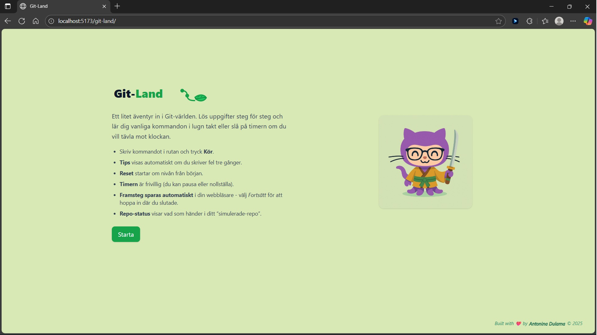
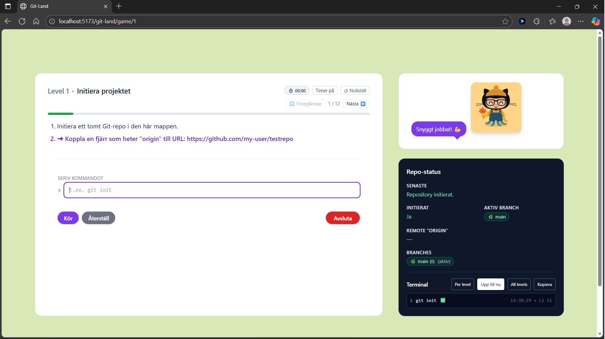
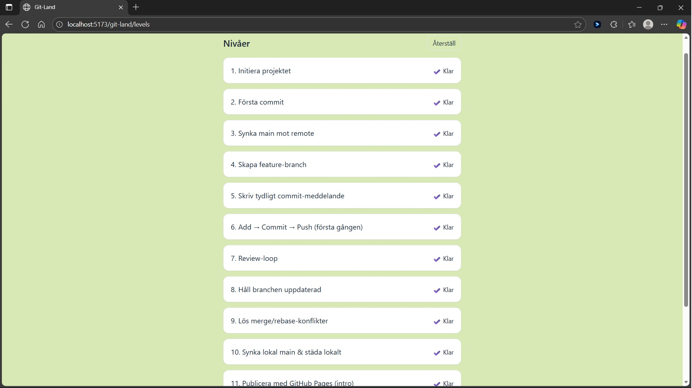
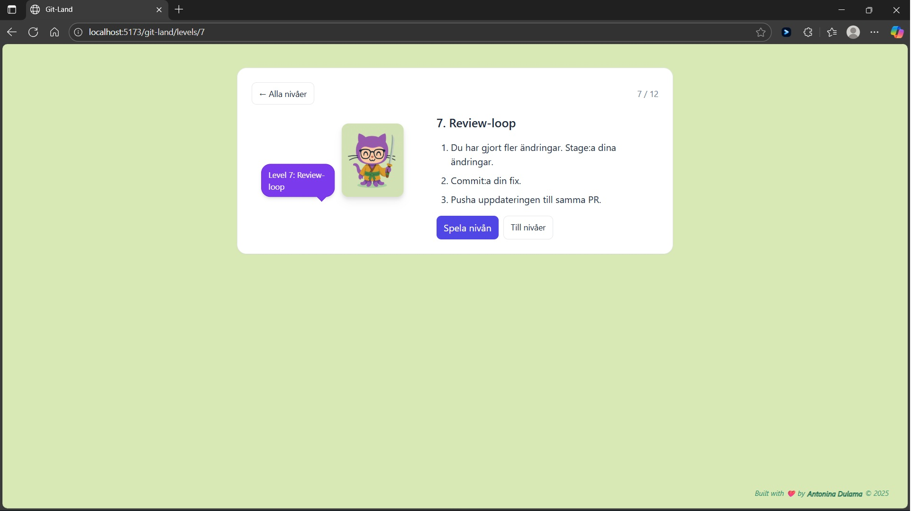
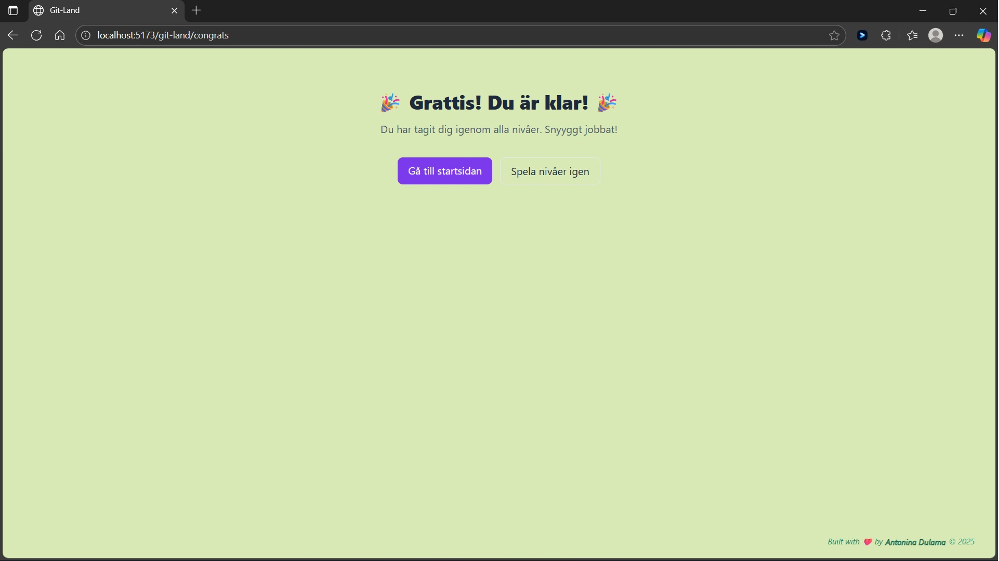
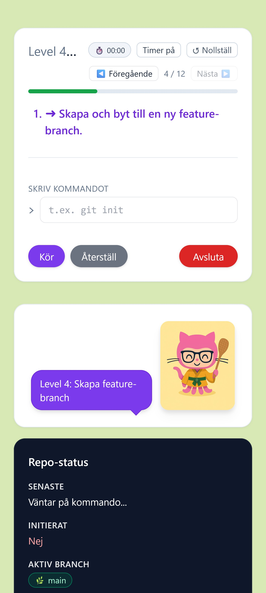

# 🧭 Git-Land


**Git-Land** is an interactive educational game that teaches Git step by step.  
Each level contains a sequence of Git-related tasks and commands.  
Players learn Git in a playful, hands-on way.

---

## 🌍 Project Overview

This project is built with **React + TypeScript**, styled using **Tailwind CSS**, and bundled with **Vite**.  
Game progress is stored in **localStorage** so users can continue later.

Main goals:
- Learn Git through interactive levels  
- Practice commands safely in a simulated terminal  
- Unlock new levels as you complete previous ones  
- Visual progress tracking and success feedback  

---

## 🧩 Tech Stack

| Purpose | Tool |
|----------|------|
| Framework | [React](https://react.dev/) |
| Styling | [Tailwind CSS](https://tailwindcss.com/) |
| Language | [TypeScript](https://www.typescriptlang.org/) |
| Build tool | [Vite](https://vitejs.dev/) |
| State persistence | `localStorage` |

---

## 🧱 Adding a New Level

To add a new level open the file : src/data/levels.ts.
Add a new level object in the **LEVELS** array:

```typescript
{
  id: 13,
  title: 'Your New Level Title',
  steps: [
    {
      text: 'Run git init to create a new repository.',
      expects: ['git init'],
      hints: ['Try typing git init'],
    },
    {
      text: 'Add all files to staging.',
      expects: ['git add .'],
      hints: [],
    },
  ],
}
```

Save the file and restart the dev server (npm run dev).

---

## 💾 How Progress Is Saved

Player progress (completed levels, current level, etc.) is saved in the browser using **localStorage**. This logic is handled in: src/state/progress.ts. 
 - The custom React hook useProgress() reads and updates this data.
 - On page reload, it automatically restores your progress.
 - The reset() function clears all saved progress.

 Example: localStorage.setItem('gitland_progress', JSON.stringify(state));

---

## 🕹️ Gameplay Flow 

1. The user visits LevelsHub (/levels) and selects a level.

2. On LevelScreen, they see the instructions and can start the game.

3. Inside GameScreen, the terminal simulation accepts Git commands.

4. Once all steps are completed, the next level unlocks.

5. After finishing all levels, the FinishGame screen with confetti appears. 🎉

---

## Screenshots

| Screen        | Example                                                     |
| ------------- | ----------------------------------------------------------- |
| Home screen   |           |
| Game screen   |           |
| Levels list   |           |
| Level details |       |
| Finish game   |           |
| Mobile version|     |


---
## 🚀 Development

Run locally:

```bash
npm install
npm run dev
```

Then open `http://localhost:5173` in your browser.

---

## 💖 Credits

Built with ❤️ by [@Antonina Dulama](https://github.com/DulamaA).
Made for learning Git in a fun, interactive way.
